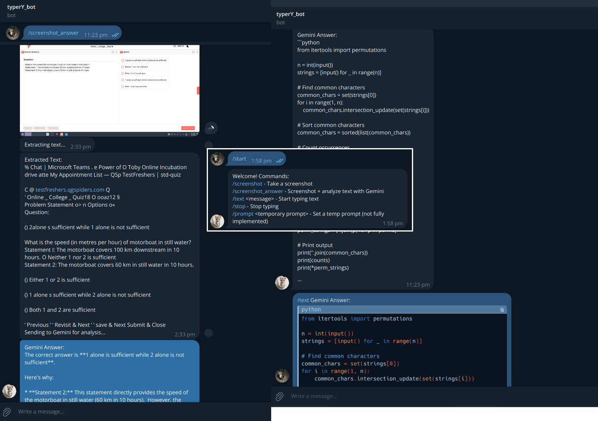

### also in linux you kina need these

```
pip install python-xlib
sudo usermod -aG input $USER
```

after these just log out and re login linux user

On Linux, Python needs permission to simulate keyboard input.
Make sure you have the X11 development headers and python-xlib installed in your venv: